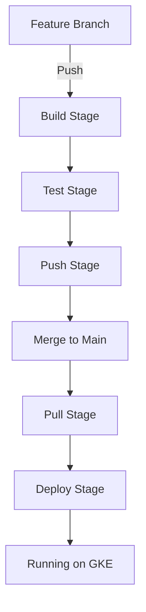

# GitLab CI/CD using GKE and Helm 👋

> A comprehensive pipeline setup with GitLab CI/CD using Google Kubernetes Engine (GKE) and Helm.


<div align="center">
	
</div>

## TL;DR (Quick Start)

1. **GCP Setup**:
   ```bash
   # Enable GKE API and create cluster
   gcloud services enable container.googleapis.com
   gcloud container clusters create my-k8s-dev --zone southamerica-east1-a
   
   # Create and download service account key
   gcloud iam service-accounts create gitlab-gke
   gcloud iam service-accounts keys create gitlab-gke.json --iam-account=gitlab-gke@<project-id>.iam.gserviceaccount.com
   ```

2. **GitLab Setup** (Settings > CI/CD > Variables):
   ```
   GKE_SERVICE_ACCOUNT=<base64 of gitlab-gke.json>
   GKE_PROJECT=<project-id>
   GKE_CLUSTER_NAME=my-k8s-dev
   GKE_ZONE=southamerica-east1-a
   CI_USER_DOCKER=<gitlab-username>
   CI_TOKEN_DOCKER=<gitlab-token>
   ```

3. **Deploy**:
   ```bash
   git push origin main
   # Watch pipeline at: GitLab > CI/CD > Pipelines
   ```

Need more details? Check the [complete setup guide](#getting-started) below.

## Getting Started

Just cloned the project? Here's how to get it running:

### 1. Initial Setup

```bash
# Clone the repository
git clone <your-repo-url>
cd my-gitlab-ci-cd-gke-helm
```

### 2. GitLab Setup

1. Go to your GitLab account and create a new project
2. Add these variables in GitLab (Settings > CI/CD > Variables):
   ```
   CI_USER_DOCKER=<your-gitlab-username>
   CI_TOKEN_DOCKER=<your-gitlab-access-token>
   ```

### 3. GCP Setup

1. Create a GCP Project (or use existing one)
2. Enable required APIs:
   ```bash
   gcloud services enable container.googleapis.com
   ```

3. Create Service Account:
   ```bash
   # Create service account
   gcloud iam service-accounts create gitlab-gke --display-name="GitLab GKE"
   
   # Add roles
   gcloud projects add-iam-policy-binding <your-project-id> \
     --member="serviceAccount:gitlab-gke@<your-project-id>.iam.gserviceaccount.com" \
     --role="roles/container.developer"
   
   # Download key
   gcloud iam service-accounts keys create gitlab-gke.json \
     --iam-account=gitlab-gke@<your-project-id>.iam.gserviceaccount.com
   ```

4. Add GCP variables to GitLab:
   ```bash
   # Convert service account key to base64
   base64 -i gitlab-gke.json | pbcopy  # Now in clipboard
   ```
   
   Add to GitLab (Settings > CI/CD > Variables):
   ```
   GKE_SERVICE_ACCOUNT=<base64-service-account-from-clipboard>
   GKE_PROJECT=<your-gcp-project-id>
   GKE_CLUSTER_NAME=my-k8s-dev
   GKE_ZONE=southamerica-east1-a
   ```

### 4. Create GKE Cluster

```bash
# Set your GCP project
gcloud config set project <your-project-id>

# Create cluster
gcloud container clusters create my-k8s-dev \
  --zone southamerica-east1-a \
  --num-nodes 2 \
  --machine-type e2-medium

# Get credentials
gcloud container clusters get-credentials my-k8s-dev --zone southamerica-east1-a
```

### 5. Configure GitLab Registry

```bash
# Create registry secret in Kubernetes
kubectl create secret docker-registry gitlab-registry \
  --docker-server=registry.gitlab.com \
  --docker-username=$CI_USER_DOCKER \
  --docker-password=$CI_TOKEN_DOCKER \
  --docker-email=<your-email>
```

### 6. Setup GitLab Runner (Optional, for local testing)

```bash
# Install GitLab Runner
brew install gitlab-runner  # macOS
# or
curl -L https://packages.gitlab.com/install/repositories/runner/gitlab-runner/script.deb.sh | sudo bash  # Ubuntu

# Register runner
gitlab-runner register \
  --url "https://gitlab.com/" \
  --registration-token "<your-project-runner-token>" \
  --description "my-gke-runner" \
  --executor "docker" \
  --docker-image "docker:19.03.12"
```

### 7. First Deployment

1. Push code to GitLab:
   ```bash
   git add .
   git commit -m "Initial setup"
   git push origin main
   ```

2. Watch the pipeline:
   - Go to your GitLab project
   - Click CI/CD > Pipelines
   - Watch the stages execute

3. Verify deployment:
   ```bash
   # Check pods
   kubectl get pods -n my-application

   # Check services
   kubectl get svc -n my-application

   # Get the application URL
   kubectl get ingress -n my-application
   ```

### Troubleshooting

If something goes wrong:

1. **Pipeline Fails**:
   - Check CI/CD > Pipelines > Latest pipeline > Failed job
   - Look at the job logs for errors

2. **Pods Not Running**:
   ```bash
   # Check pod status
   kubectl get pods -n my-application
   
   # Check pod logs
   kubectl logs <pod-name> -n my-application
   
   # Describe pod for events
   kubectl describe pod <pod-name> -n my-application
   ```

3. **Registry Issues**:
   ```bash
   # Verify secret
   kubectl get secret gitlab-registry -n my-application -o yaml
   
   # Check if secret is properly referenced
   kubectl describe pod <pod-name> -n my-application | grep "pull secret"
   ```

## Requirements

Before you begin, ensure you have the following installed:
* GitLab account
* Docker installed locally
* Google Cloud Platform (GCP) account
* `kubectl` - Kubernetes command-line tool
* `helm` - Kubernetes package manager
* `gcloud` - Google Cloud SDK

## Pipeline Overview

The GitLab CI/CD pipeline (`.gitlab-ci.yml`) automates the entire deployment process. Here's how it works:

### Pipeline Stages

1. **Build**
   - Builds Docker images for frontend and backend
   - Uses multi-stage build for backend optimization
   - Runs on all branches except main

2. **Test**
   - Builds images
   - Runs containers
   - Validates health check endpoints
   - Ensures application functionality

3. **Push**
   - Authenticates with GitLab registry
   - Pushes images to registry
   - Tags images with version numbers

4. **Pull**
   - Pulls images from registry
   - Validates container startup
   - Only runs on main branch

5. **Deploy**
   - Uses Helm for deployment
   - Configures GKE authentication
   - Deploys application to Kubernetes
   - Sets up services and ingress

### Required Variables

Configure these variables in GitLab (Settings > CI/CD > Variables):

| Variable | Description |
|----------|-------------|
| `CI_USER_DOCKER` | GitLab registry username |
| `CI_TOKEN_DOCKER` | GitLab registry token |
| `GKE_SERVICE_ACCOUNT` | Base64 encoded GCP service account key |
| `GKE_PROJECT` | GCP project ID |
| `GKE_CLUSTER_NAME` | GKE cluster name |
| `GKE_ZONE` | GCP zone (e.g., southamerica-east1-a) |

### Pipeline Configuration

```yaml
# Key pipeline variables
variables: 
  CI_REGISTRY: registry.gitlab.com
  REGISTRY_REPO_NAME: estudo-ci
  NAMESPACE: my-application
  FIRST_IMAGE: backend
  SECOND_IMAGE: frontend
  BACK_VERSION: "1.0"
  FRONT_VERSION: "1.0"
```

### Automatic vs Manual Deployment

While the [Quick Start](#quick-start-manual-deployment) section shows manual deployment steps, the pipeline automates everything:

| Task | Manual | Pipeline |
|------|---------|----------|
| GKE Authentication | Configure `gcloud` locally | Uses service account |
| Image Building | Local Docker build | Automated in CI |
| Registry Access | Local Docker login | Uses CI variables |
| Deployment | Manual Helm commands | Automated with variables |
| Testing | Manual container testing | Automated health checks |

### Pipeline Workflow



## Quick Start (Manual Deployment)

If you already have all requirements installed and configured, here are the steps for manual deployment:

1. **Clone the repository**
```bash
git clone <your-repo-url>
cd my-gitlab-ci-cd-gke-helm
```

2. **Configure GKE Access**
```bash
# Set your GCP project
gcloud config set project <your-project-id>

# Create GKE cluster (if not exists)
gcloud container clusters create my-k8s-dev --zone southamerica-east1-a

# Get credentials for kubectl
gcloud container clusters get-credentials my-k8s-dev --zone southamerica-east1-a
```

3. **Configure GitLab Registry Access**
```bash
# Create registry secret in Kubernetes
kubectl create secret docker-registry gitlab-registry \
  --docker-server=registry.gitlab.com \
  --docker-username=<your-gitlab-username> \
  --docker-password=<your-registry-token> \
  --docker-email=<your-email>
```

4. **Create Service Account for GitLab**
```bash
# Apply the service account configuration
kubectl apply -f gitlab-admin-service-account.yaml
```

5. **Get Cluster Information for GitLab**
```bash
# Get API URL
kubectl cluster-info | grep -E 'Kubernetes master|Kubernetes control plane' | awk '/http/ {print $NF}'

# Get CA Certificate
kubectl get secret default-token-l76rk -o jsonpath="{['data']['ca\.crt']}" | base64 --decode

# Get Service Account Token
kubectl -n kube-system describe secret $(kubectl -n kube-system get secret | grep gitlab | awk '{print $1}')
```

6. **Deploy Using Helm**
```bash
# Go to Helm chart directory
cd my-helm

# Validate the chart
helm lint .

# Test the deployment (dry-run)
helm install my-app . --dry-run --debug

# Deploy the application
helm install my-app . --create-namespace --namespace my-app
```

7. **Verify Deployment**
```bash
# Check pods status
kubectl get pods -n my-app

# Check services
kubectl get svc -n my-app

# Check ingress
kubectl get ingress -n my-app
```

## Step by Step Guide

For a detailed explanation of each component and configuration, please refer to:

1. [Helm Chart Documentation](./my-helm/README.md)
2. [GitLab CI/CD Pipeline Configuration](./.gitlab-ci.yml)

## Troubleshooting

If you encounter issues during deployment:

1. **Check GKE Cluster Status**
```bash
gcloud container clusters list
kubectl cluster-info
```

2. **Verify GitLab Registry Secret**
```bash
kubectl get secrets | grep gitlab-registry
```

3. **Check Pod Logs**
```bash
kubectl logs -f <pod-name> -n my-app
```

4. **Debug Helm Release**
```bash
helm list -n my-app
helm get manifest my-app -n my-app
```

## References
* [GitLab Kubernetes Integration](https://docs.gitlab.com/ee/user/project/clusters/add_remove_clusters.html)
* [GitLab Cluster Configuration Guide](https://about.gitlab.com/handbook/customer-success/demo-systems/tutorials/getting-started/configuring-group-cluster)
* [Automated Kubernetes Deployments](https://medium.com/@yanick.witschi/automated-kubernetes-deployments-with-gitlab-helm-and-traefik-4e54bec47dcf)

## Author

👤 **Tadeu Bernacchi**

* Website: http://www.tadeubernacchi.com.br/
* Twitter: [@tadeuuuuu](https://twitter.com/tadeuuuuu)
* Github: [@tbernacchi](https://github.com/tbernacchi)
* LinkedIn: [@tadeubernacchi](https://linkedin.com/in/tadeubernacchi)

## Show your support

Give a ⭐️ if this project helped you!

***
_This README was generated with ❤️ by [readme-md-generator](https://github.com/kefranabg/readme-md-generator)_
